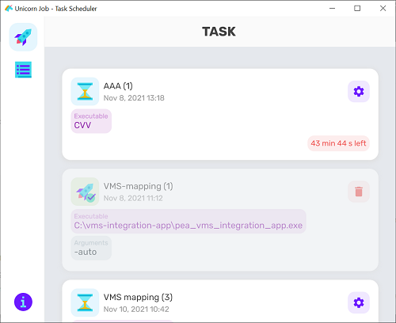
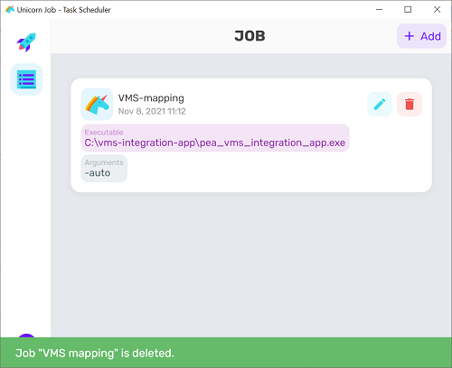
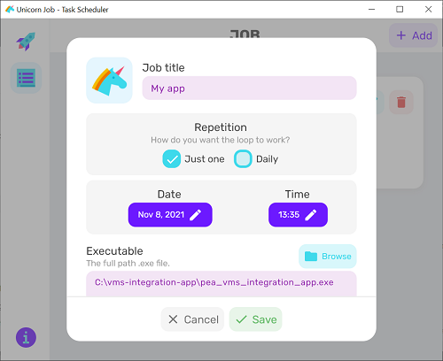
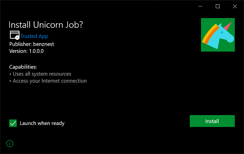

# Unicorn Job
Simple Task Scheduler App (2021)

## Getting Started
This is my experimental project on Flutter for Windows.
You can add a Job and have it run cmd at the specified time. just open the program.





## Features
- Create/Update/Delete a Job (Single task /Daily task).
- Run the tasks using cmd executable file and arguments.
- Force launch the task or skip the task.
- Delete the task manually.

## what I learned
The idea of this project I would like to try using 2 things:
 - Hive and Hive generator : NO-SQL lightweight and blazing fast key-value database (Pure Dart).
 - msix : Create the Msix installer.

## Note
if you want to build the project.
Call Generator to create Hive adapter.
```
flutter packages pub run build_runner build
```

build Flutter Windows and run msix.
```
flutter build windows --release
flutter pub run msix:create
```

## Download
you can download the zip file or installer file in /release folder.

